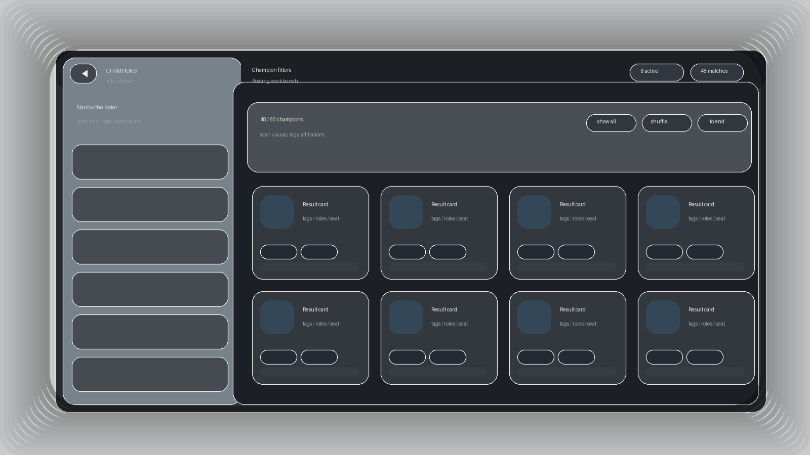
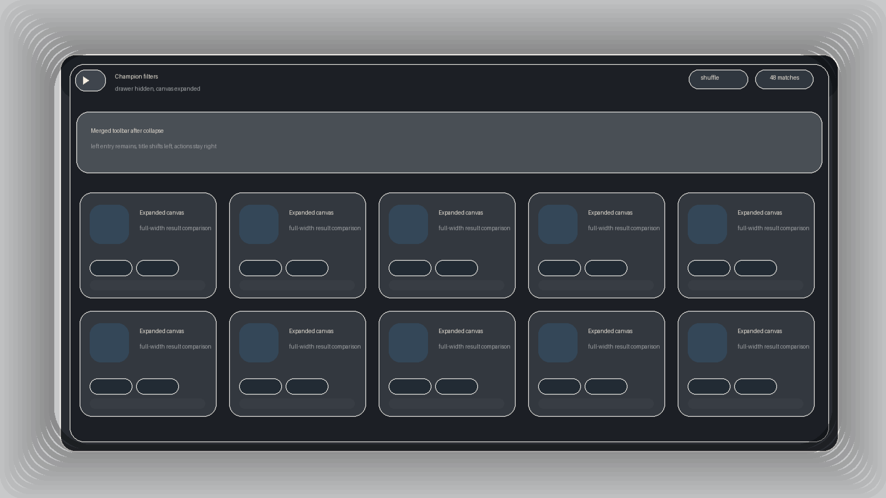

# Champions 工作台壳层重构设计稿

- 日期：2026-04-21
- 作用：沉淀 `Champions` 页从“左筛选右列表”升级到“悬浮工作台”的结构方案、交互状态和实施边界。
- 当前状态：本篇只记录 `Champions` 工作台的起源设计与局部状态约束；全站统一推广与旧实现清退见 `docs/modules/shared-components/filter-workbench-rollout-plan.md`。

## 目标与非目标

### 目标

- 把 `Champions` 页改成“上方全站导航 + 下方统一工作台大壳”的双层结构。
- 保留现有筛选规则、结果卡、详情跳转和 URL 同步契约，只重构壳层、滚动模型和顶部工具栏组织。
- 让桌面端更接近 Codex 这类工作台：左抽屉有明显前后层次，右主区是更实的内容画布，左右都能独立滚动。
- 把本次讨论中的视觉决策与参考态落进仓库，后续实现与复核不再依赖聊天记录回溯。

### 非目标

- 不重写 `Champions` 的筛选业务规则、结果卡契约与详情跳转协议。
- 不引入新的筛选业务维度，也不改 `HashRouter` / GitHub Pages 兼容方式。
- 不复制桌面系统红绿灯或整套原生窗口细节；只借“壳层关系”和“工具栏合并”的结构语言。

## 参考态

### 展开态

- 左侧抽屉完整存在，带中等玻璃感和独立前景层次。
- 顶部工具栏虽然分成左段和右段，但视觉上必须连成一条。
- 右主区要比左抽屉更深、更实，形成“资料画布”而不是普通网页卡片。

### 收起态

- 左抽屉主体、边框和残余 gutter 全部退场。
- 只保留一个紧凑展开入口，不保留整条窄边轨。
- 原先位于右工具栏左端的一组信息左移贴边，右端动作继续保持右对齐。

## 工具栏合并规则

- 工具栏分成三块语义区：`展开入口 / 左侧识别信息`、`页面主标题与上下文`、`稳定动作区`。
- `展开态`
  - 左块宽度跟随抽屉宽度。
  - 右块与左块无缝拼接，不能看起来像两条分开的栏。
  - 右块左端承接页面标题和上下文说明，右块右端保留 badge / 状态 / 稳定动作。
- `收起态`
  - 左块压缩成紧凑入口按钮。
  - 原右块左端信息补位到入口按钮后方，整体仍保持左对齐。
  - 原右块右端动作不应因为收起而整体漂移。

## 面板归位映射

- 左顶部区：筛选状态 badge、`清空全部`、简短提示。
- 左主体区：现有 `ChampionsPrimaryFilters` + `ChampionsAdditionalFilters`，不改规则，只重排表面和节奏。
- 右顶部区：页面标题、当前命中说明、compact metrics、当前筛选摘要、`显示全部/收起`、`随机排序`、`复制当前链接`。
- 右主体区：现有视觉档案 + 结果卡网格 + 空态。

## 滚动模型

- 桌面端：工作台使用固定可视高度；左抽屉和右主区各自滚动。
- 右主区滚动容器负责承载顶部说明、结果操作、视觉档案和结果卡列表。
- 筛选变更、默认窗口展开/收起后，右主区回到顶部摘要区。
- 随机排序不强制回顶。
- 进入详情再返回时，恢复的是右主区滚动位置，不再恢复整页 `window.scrollY`。
- 移动端退化为单列普通网页滚动，不维持桌面工作台高度锁定。

## 实施边界

- 工作台壳层已从 `Champions` 推广为全站统一 `PageWorkbenchShell`；跨页推广与旧实现清退以 shared-components rollout 文档为准。
- 共享抽取边界已经从筛选页专用实现迁到 `src/components/workbench/`。
- 允许继续复用现有筛选字段组件、结果卡组件和视觉档案组件；不因为壳层变化就重新抽一轮通用卡片。
- 参考图当前以“结构示意图”方式入仓，用来锁定状态关系；如果后续需要更高保真截图，再补充替换同路径资产。

## 验收口径

- 桌面端存在统一外层工作台大壳。
- 展开态与收起态都具备清晰的工具栏合并效果。
- 收起后左抽屉主体完全消失，右主区无残余空白轨。
- 左右面板可独立滚动，快捷按钮只作用于右主区。
- 文档、图片和实际实现的状态命名一致，后续复核不需要回看聊天记录。
